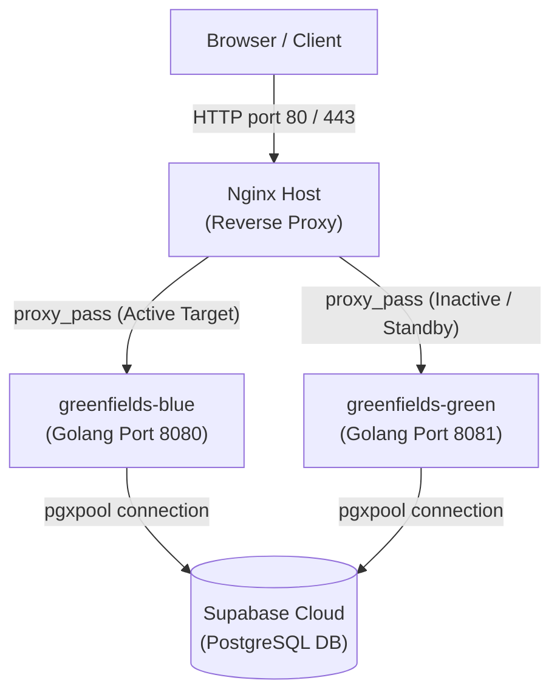

# PT. Greenfields Indonesia — Deployment & High Availability Guideline
## OpsSight Predictive Maintenance Platform

Dokumen ini menjelaskan arsitektur ketersediaan tinggi (*High Availability*), peta jalan skalabilitas (*Scalability Blueprint*), serta panduan langkah demi langkah penyebaran (*deployment*) sistem OpsSight menggunakan strategi **Host-Based Blue-Green Deployment** pada server VPS Ubuntu 22.04 LTS (1 Core CPU, 2 GB RAM).

---

## 1. Arsitektur High Availability (HA Architecture)

Sistem memanfaatkan Nginx sebagai reverse proxy eksternal untuk mengarahkan lalu lintas data ke instansi backend Golang yang aktif.




### Mekanisme High Availability (HA)

| Komponen | Mekanisme HA | Waktu Pemulihan (*Recovery Time*) |
| :--- | :--- | :--- |
| **Golang API** | Systemd Daemon (`Restart=always`) | $< 5$ detik |
| **Nginx Proxy** | Systemd Service + Atomic Config Reload | Zero-downtime (`nginx -s reload`) |
| **Database** | Supabase Cloud Managed HA | Dikelola otomatis oleh penyedia layanan awan |
| **AI Service** | Cache Lokal (30 menit) + Fallback Heuristik | Instan (tanpa jeda) |
| **Penyimpanan Foto** | Direktori lokal `/uploads/` sebagai cadangan | Instan (bila Supabase Storage terganggu) |

---

## 2. Peta Jalan Skalabilitas (Scalability Blueprint)

Arsitektur dirancang untuk dapat berkembang secara modular seiring dengan pertumbuhan beban kerja:

| Tahap | Kondisi Beban | Tindakan Skalabilitas (*Scaling Action*) |
| :--- | :--- | :--- |
| **MVP (Sekarang)** | 1 VM (1 Core, 2 GB RAM), $< 50$ pengguna | Penyebaran satu biner Golang (konkurensi tinggi native lewat Goroutines) + Nginx Host. |
| **Scale Vertical** | Peningkatan beban sensor virtual | Upgrade kapasitas CPU/RAM server VPS. Go Runtime otomatis memanfaatkan penambahan core (GOMAXPROCS). |
| **Scale Horizontal** | $> 100$ pengguna konkuren aktif | Penambahan VM server kedua. Nginx Host bertindak sebagai *Load Balancer* untuk membagi beban ke VM1 dan VM2. |
| **Database Scale** | Latensi kueri database melambat | Pemisahan koneksi PostgreSQL ke VM dedicated, atau peningkatan tier Supabase. |
| **Full HA** | Beban kritis, bebas downtime | Integrasi Read Replicas PostgreSQL + Redis Session Cache + CDN. |

---

## 3. Spesifikasi Kebutuhan Sumber Daya VM

| Komponen | Teknologi | Hosting | Kebutuhan RAM |
| :--- | :--- | :--- | :--- |
| **Web Dashboard** | Next.js 16 Static | Vercel / Nginx Static | 0 MB RAM (Disajikan statis oleh Nginx) |
| **Mobile App** | React Native Expo | Expo Go / EAS | 0 MB RAM di VM server |
| **Backend API** | Golang v1.25 + Gin | VPS Host Port 8080/8081 | 30--50 MB RAM |
| **Reverse Proxy** | Nginx | VPS Host Port 80 / 443 | 10 MB RAM |
| **Database** | PostgreSQL | Supabase Cloud | Managed Service (0 MB RAM di VM) |
| **AI Service** | Gemini 2.0 Flash | Google via OpenRouter | Cloud API (0 MB RAM di VM) |
| **Total VM Server** | --- | **Ubuntu 22.04 LTS** | **360 MB dari 2 GB RAM (18% terpakai) $\checkmark$** |

---

## 4. Konfigurasi Sistem (System Config Files)

### 4.1 Systemd Service Blue (`/etc/systemd/system/greenfields-blue.service`)
```ini
[Unit]
Description=Greenfields Predictive Maintenance Go Backend - BLUE
After=network.target

[Service]
Type=simple
User=root
WorkingDirectory=/var/www/greenfields/server
ExecStart=/var/www/greenfields/server/server-bin
Restart=always
RestartSec=5
EnvironmentFile=/var/www/greenfields/server/.env-blue

[Install]
WantedBy=multi-user.target
```

### 4.2 Systemd Service Green (`/etc/systemd/system/greenfields-green.service`)
```ini
[Unit]
Description=Greenfields Predictive Maintenance Go Backend - GREEN
After=network.target

[Service]
Type=simple
User=root
WorkingDirectory=/var/www/greenfields/server
ExecStart=/var/www/greenfields/server/server-bin
Restart=always
RestartSec=5
EnvironmentFile=/var/www/greenfields/server/.env-green

[Install]
WantedBy=multi-user.target
```

### 4.3 Nginx Reverse Proxy (`/etc/nginx/sites-available/greenfields`)
```nginx
upstream backend_server {
    server 127.0.0.1:8080; # Diperbarui otomatis ke :8081 oleh script deploy
}

server {
    listen 80;
    server_name _;

    root /var/www/greenfields/out;
    index index.html;

    # Rate Limiting
    limit_req_zone $binary_remote_addr zone=api:10m rate=10r/s;
    limit_req_zone $binary_remote_addr zone=login:10m rate=5r/m;

    location / {
        try_files $uri $uri/ /index.html;
    }

    location ~* \.(js|css|png|jpg|jpeg|gif|ico|svg|woff|woff2|ttf|eot)$ {
        expires 1y;
        add_header Cache-Control "public, no-transform";
    }

    location /api {
        limit_req zone=api burst=20 nodelay;
        proxy_pass http://backend_server;
        proxy_http_version 1.1;
        proxy_set_header Upgrade $http_upgrade;
        proxy_set_header Connection 'upgrade';
        proxy_set_header Host $host;
        proxy_cache_bypass $http_upgrade;
        proxy_set_header X-Real-IP $remote_addr;
        proxy_set_header X-Forwarded-For $proxy_add_x_forwarded_for;
    }

    location /api/v1/auth/login {
        limit_req zone=login burst=5;
        proxy_pass http://backend_server;
    }

    location /health {
        proxy_pass http://backend_server/health;
        access_log off;
    }
}
```

---

## 5. Panduan Deployment Blue-Green (Step-by-Step Deployment)

### Langkah 1: Build & Ekspor Lokal (Local Machine)
1. **Kompilasi Frontend (Next.js)**:
   Setel konfigurasi Next.js (`output: 'export'`) pada `next.config.js`, jalankan kompilasi, dan kompres aset statis.
   ```bash
   pnpm build
   cd out
   zip -r ../client-dist.zip .
   cd ..
   ```
2. **Kompilasi Backend (Golang)**:
   Lakukan kompilasi silang (*cross-compilation*) untuk menargetkan arsitektur server Linux 64-bit.
   ```powershell
   $env:GOOS="linux"
   $env:GOARCH="amd64"
   go build -ldflags="-w -s" -o server-bin main.go
   ```
3. **Kirim Berkas ke VM**:
   Kirim aset biner dan frontend statis ke server target menggunakan protokol secure copy.
   ```bash
   scp server-bin client-dist.zip root@<IP_VPS>:/var/www/greenfields/
   ```

### Langkah 2: Persiapan Awal di Server (Hanya Sekali)
Jalankan perintah ini di terminal server VPS saat instalasi pertama:
```bash
# Buat struktur direktori
mkdir -p /var/www/greenfields/out
mkdir -p /var/www/greenfields/server

# Daftarkan Systemd Service
ln -sf /var/www/greenfields/greenfields-blue.service /etc/systemd/system/
ln -sf /var/www/greenfields/greenfields-green.service /etc/systemd/system/
systemctl daemon-reload

# Konfigurasi Nginx
ln -sf /var/www/greenfields/nginx.conf /etc/nginx/sites-available/greenfields
ln -sf /etc/nginx/sites-available/greenfields /etc/nginx/sites-enabled/
rm -f /etc/nginx/sites-enabled/default
systemctl restart nginx
```

### Langkah 3: Eksekusi Peralihan Trafik (Blue-Green Switch)
Untuk memperbarui backend secara aman tanpa jeda mati layanan (*zero downtime*):

1. **Deteksi Lingkungan Aktif**:
   Periksa port backend mana yang saat ini sedang melayani trafik aktif.
   ```bash
   # Cek port aktif
   netstat -tulnp | grep server-bin
   ```
   *Asumsi: Lingkungan **BLUE (:8080)** sedang aktif berjalan. Maka kita akan melakukan update ke lingkungan **GREEN (:8081)**.*

2. **Perbarui dan Nyalakan Lingkungan Inaktif (GREEN)**:
   Pindahkan file biner backend baru `server-bin` ke direktori server, perbarui berkas konfigurasi `.env-green` dengan port 8081, lalu nyalakan layanan.
   ```bash
   # Salin biner baru
   cp /var/www/greenfields/server-bin /var/www/greenfields/server/server-bin
   
   # Nyalakan layanan Green
   systemctl start greenfields-green
   ```

3. **Lakukan Uji Kelayakan Kesehatan Lokal (Health Check)**:
   Verifikasi status kesiapan port inaktif sebelum mengalihkan lalu lintas data utama.
   ```bash
   curl -I http://localhost:8081/health
   ```
   *Kriteria lulus: Mengembalikan status HTTP `200 OK`.*

4. **Alihkan Rute Trafik Nginx (Atomic Switch)**:
   Perbarui berkas konfigurasi `/etc/nginx/sites-available/greenfields` pada bagian `upstream` agar mengarah ke port 8081, lalu muat ulang Nginx.
   ```bash
   # Edit upstream ke server 127.0.0.1:8081
   sed -i 's/8080/8081/g' /etc/nginx/sites-available/greenfields
   
   # Muat ulang konfigurasi Nginx secara aman (Atomic)
   nginx -t && nginx -s reload
   ```
   *Proses pengalihan trafik ini berlangsung kurang dari 1 detik dan tanpa memutus koneksi aktif.*

5. **Matikan Lingkungan Lama (BLUE)**:
   Setelah trafik terbukti lancar mengarah ke layanan GREEN, matikan layanan BLUE untuk menghemat penggunaan RAM VM.
   ```bash
   systemctl stop greenfields-blue
   ```

---

## 6. Pemantauan & Diagnostik VPS (Monitoring & Log Checks)

Gunakan perintah terminal berikut di VPS Ubuntu untuk memantau status kesehatan sistem pasca-deployment:

```bash
# Meninjau status operasional service aktif
systemctl status greenfields-green

# Menampilkan log stream backend secara real-time
journalctl -u greenfields-green -f --no-tail

# Meninjau penggunaan CPU & RAM server secara real-time
htop

# Meninjau sisa ruang disk penyimpanan
df -h
```
