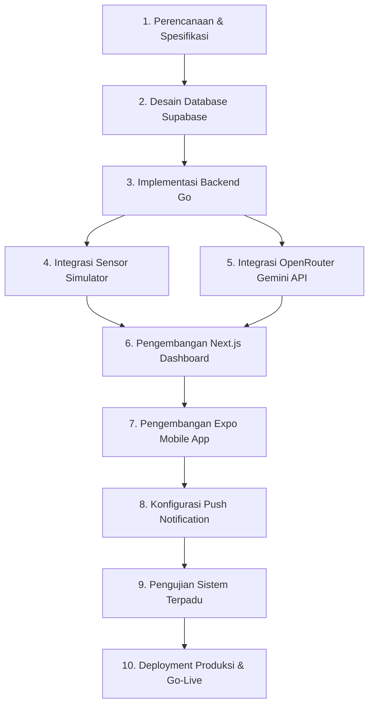
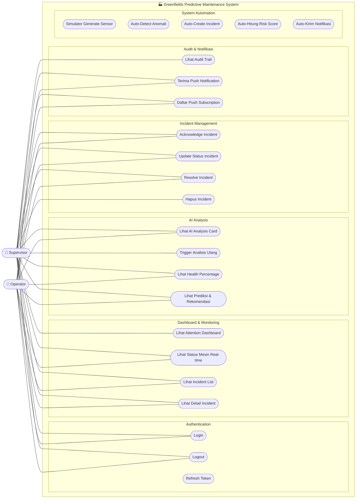
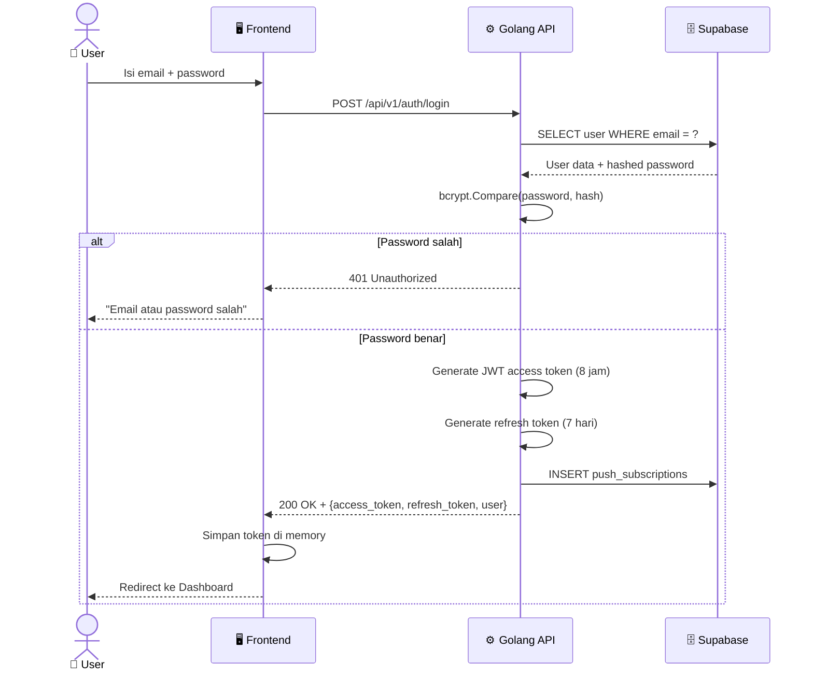
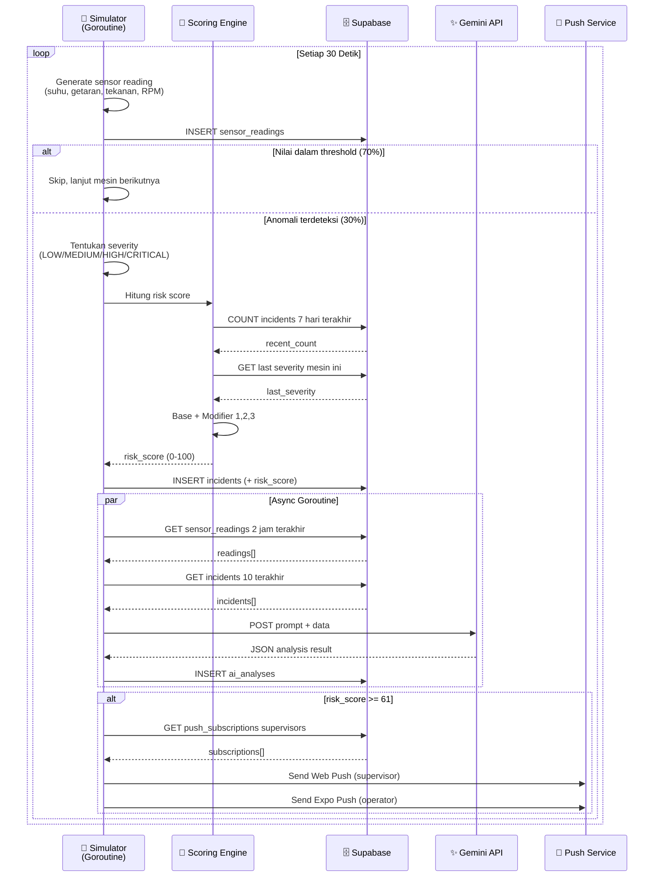
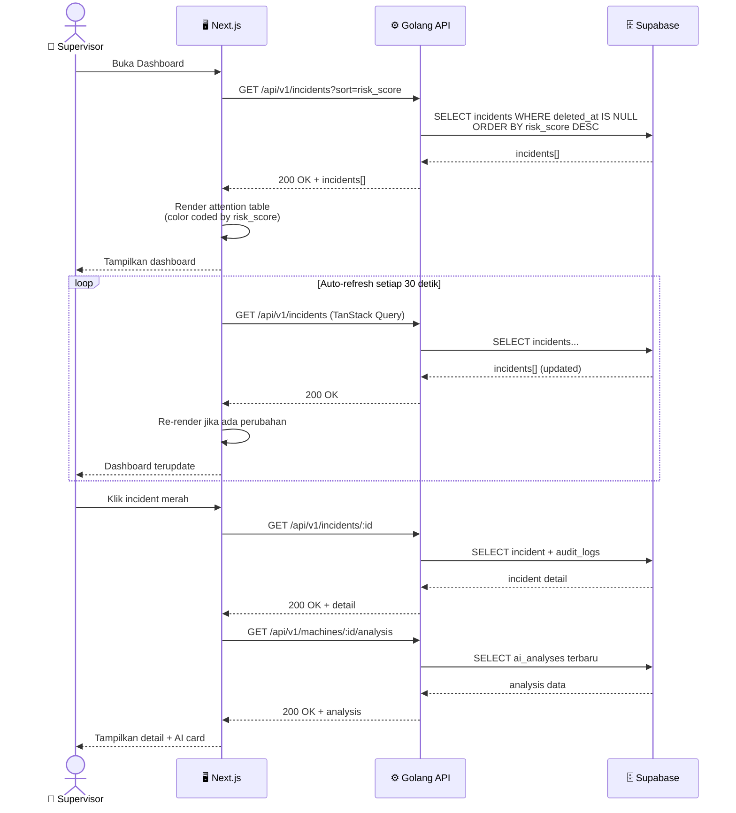
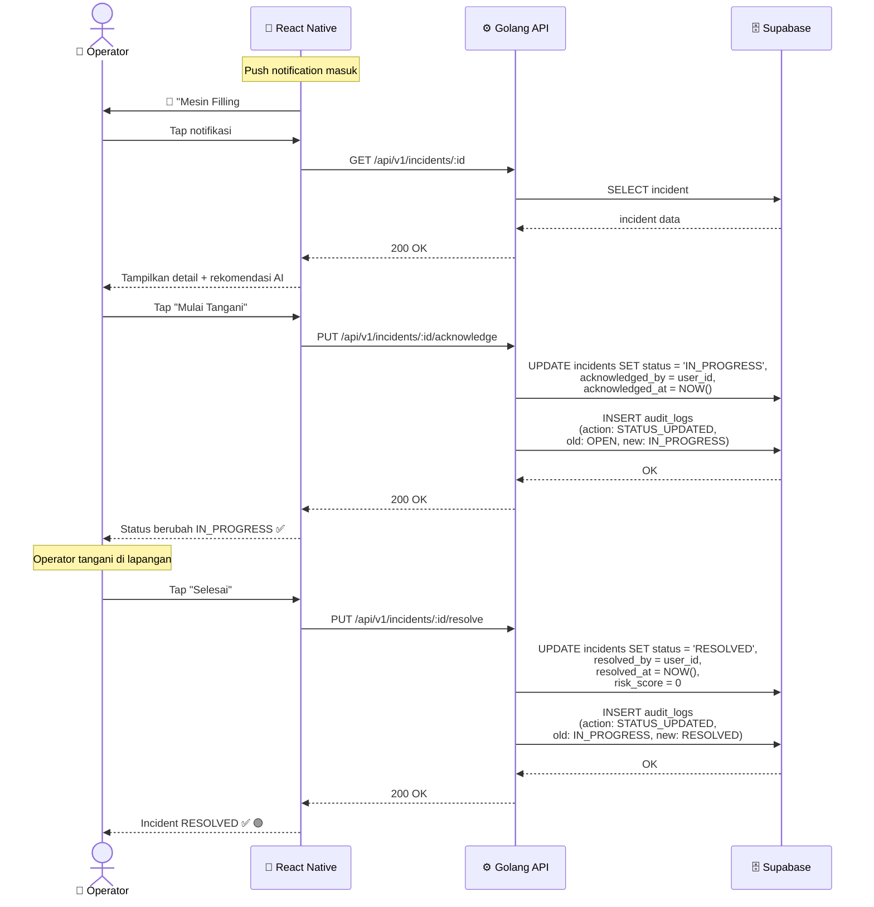
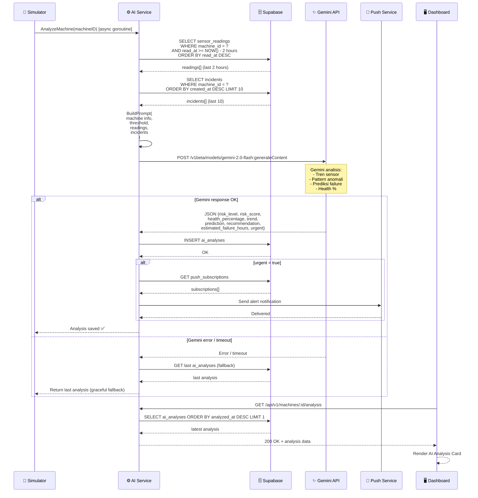
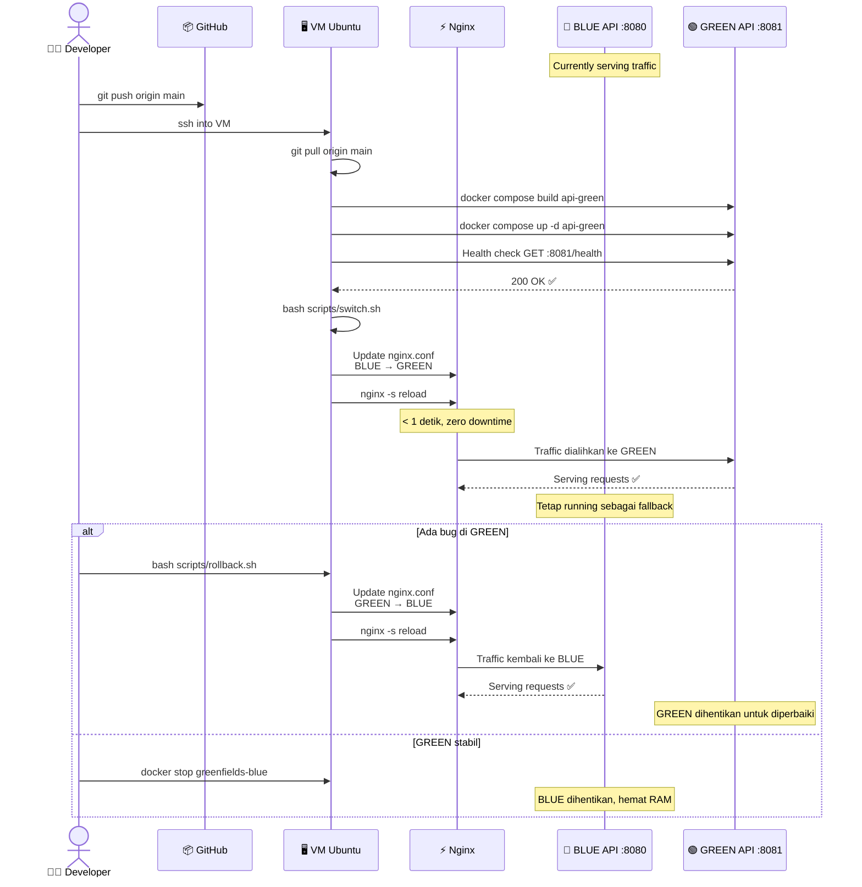

# PT. Greenfields Indonesia — System Design, Workflow & Architecture Diagram
## OpsSight Predictive Maintenance Platform

Dokumen ini menjelaskan Problem Statement, rancangan arsitektur sistem, alur kerja, diagram UML (Use Case & Sequence Diagrams), rancangan skema database PostgreSQL, logika bisnis inti, serta kebutuhan non-fungsional dari platform **OpsSight** di **PT. Greenfields Indonesia**.

---

## 1. Problem Statement

Greenfields mengelola volume data yang besar terkait aktivitas, aset, dan log insiden setiap harinya. Kendala utama tim operasional adalah **keterlambatan dalam mendeteksi anomali** — data mendesak tenggelam di antara ribuan baris data normal di database, menghambat tindakan korektif yang cepat.

| Masalah | Dampak | Solusi GIAMS / OpsSight |
| :--- | :--- | :--- |
| **Data darurat tidak terlihat** | Respons terlambat | Attention Logic Dashboard |
| **Tidak ada audit trail** | Tidak bisa investigasi | Auto audit log setiap perubahan |
| **Data sulit difilter** | Operator kelebihan informasi | Filter & sort by severity |
| **Sistem tidak scalable** | Bottleneck saat data tumbuh | Golang Native Concurrency (Goroutines) + Nginx Load Balancing |

---

## 2. Pendahuluan & Batasan Produk

OpsSight adalah platform pemeliharaan prediktif (*predictive maintenance*) dan manajemen insiden industri terintegrasi yang memantau **5 mesin virtual utama** di area pabrik PT. Greenfields Indonesia:
1.  **Mesin Pasteurisasi #1 (`PST-001`)**
2.  **Mesin Filling #2 (`FLL-002`)**
3.  **Conveyor Belt A (`CNV-001`)**
4.  **Cold Storage #3 (`CLD-003`)**
5.  **Boiler Unit (`BLR-001`)**

Sistem ini didesain menggunakan arsitektur monorepo dengan batasan telemetri parameter sensor (*Suhu, Getaran, Tekanan, RPM, Efisiensi*) disimulasikan setiap 15-30 detik. Analisis AI prediktif berjalan secara asinkron (*non-blocking*) memanggil model Gemini 2.0 Flash melalui API gateway OpenRouter.

---

## 3. Arsitektur Sistem (System Architecture)

OpsSight dibangun di atas tiga komponen utama yang saling terintegrasi:

1.  **Backend API (`server/`)**: Runtime berbasis **Golang 1.25** dan framework **Gin**. Menangani komunikasi REST API statis (stateless JWT), simulator sensor di background goroutine, penghitungan risiko insiden dinamis, dan pengiriman notifikasi push.
2.  **Web Dashboard (`client/`)**: Dashboard berbasis **Next.js 16 (App Router)** dan **Tailwind CSS v4** untuk Supervisor. Menyajikan grafik telemetri interaktif (`Recharts`), dasbor insiden kritis (*Attention Dashboard*), serta antarmuka pemicuan analisis AI manual.
3.  **Mobile App (`mobile/`)**: Aplikasi mobile berbasis **Expo 55 (React Native)** untuk Operator Lapangan (Mekanik). Digunakan untuk masuk (*login*) menggunakan akun mekanik, melihat daftar mesin yang menjadi tanggung jawabnya (PIC), merespons alarm/insiden baru, memperbarui status perbaikan, dan mengunggah foto bukti perbaikan mesin langsung ke Supabase Storage.

---

## 4. Alur Kerja & Diagram UML (Workflow & UML Diagrams)

### 4.1 Diagram Alur Kerja Implementasi
Berikut adalah alur tahapan pengembangan dan implementasi platform dari fase inisiasi hingga penyebaran produksi:

### 4.2 Use Case Diagram
Mermaid diagram di bawah ini menunjukkan hak akses fungsionalitas sistem berdasarkan dua aktor utama (Supervisor & Operator) serta otomatisasi sistem:

#### Tabel Fungsional Use Case

| ID | Use Case | Supervisor | Operator | Keterangan |
|---|---|---|---|---|
| **UC1** | Login | ✅ | ✅ | Menggunakan email + password |
| **UC2** | Logout | ✅ | ✅ | Invalidate token otorisasi |
| **UC3** | Refresh Token | ✅ | ✅ | Diperbarui otomatis oleh sistem client |
| **UC4** | Lihat Attention Dashboard | ✅ | ❌ | Dasbor utama (Web PWA saja) |
| **UC5** | Lihat Status Mesin Real-time | ✅ | ✅ | Dasbor status mesin (Web + Mobile) |
| **UC6** | Lihat Incident List | ✅ | ✅ | Urut berdasarkan skor risiko (*risk score*) |
| **UC7** | Lihat Detail Incident | ✅ | ✅ | Informasi deteksi telemetri & foto |
| **UC8** | Lihat AI Analysis Card | ✅ | ✅ | Persentase kesehatan, prediksi, & mitigasi |
| **UC9** | Trigger Analisis Ulang | ✅ | ❌ | Memaksa proses hitung Gemini ulang |
| **UC10** | Lihat Health Percentage | ✅ | ✅ | Persentase keandalan mesin (0-100%) |
| **UC11** | Lihat Prediksi & Rekomendasi | ✅ | ✅ | Teks berbahasa Indonesia keluaran Gemini |
| **UC12** | Acknowledge Incident | ✅ | ✅ | Mengubah status insiden dari OPEN $\to$ IN_PROGRESS |
| **UC13** | Update Status Incident | ✅ | ✅ | Memperbarui kemajuan perbaikan |
| **UC14** | Resolve Incident | ✅ | ✅ | Mengubah status IN_PROGRESS $\to$ RESOLVED (skor reset 0) |
| **UC15** | Hapus Incident | ✅ | ❌ | Soft delete insiden oleh Supervisor |
| **UC16** | Lihat Audit Trail | ✅ | ❌ | Rekam jejak seluruh perubahan status insiden |
| **UC17** | Terima Push Notification | ✅ | ✅ | Browser push (Supervisor) & Expo push (Operator) |
| **UC18** | Daftar Push Subscription | ✅ | ✅ | Mengaitkan token perangkat saat login pertama kali |
| **UC19-23** | System Automation | 🤖 | 🤖 | Otomatisasi sensor, anomali, kalkulasi risiko, notifikasi |

---

### 4.3 Sequence Diagrams Alur Interaksi

#### 4.3.1 Sequence Diagram — Login & Auth

#### 4.3.2 Sequence Diagram — Simulator & Auto Incident

#### 4.3.3 Sequence Diagram — Supervisor Lihat Dashboard

#### 4.3.4 Sequence Diagram — Operator Resolve Incident

#### 4.3.5 Sequence Diagram — AI Analysis (Gemini)

#### 4.3.6 Sequence Diagram — Blue-Green Deployment

---

## 5. Desain Database & Logika Bisnis (System Design & Core Logics)

### 5.1 Skema Tabel Database (Database Schema)
Database PostgreSQL didefinisikan menggunakan skema tabel berikut, disesuaikan dengan kondisi database produksi di Supabase Cloud:

#### 5.1.1 Tabel `users`
Menyimpan informasi data kredensial pengguna (Supervisor, Operator) dan status keaktifan.
*   **Kolom**:
    *   `id` (`uuid`, Primary Key)
    *   `name` (`varchar`)
    *   `email` (`varchar`, Unique)
    *   `password` (`varchar`, Hashed bcrypt)
    *   `role` (`varchar`, `SUPERVISOR` / `OPERATOR`)
    *   `phone` (`varchar`, Nullable)
    *   `is_active` (`bool`)
    *   `created_at` (`timestamptz`)
    *   `updated_at` (`timestamptz`)

#### 5.1.2 Tabel `machines`
Menyimpan informasi master data 5 mesin utama di pabrik.
*   **Kolom**:
    *   `id` (`uuid`, Primary Key)
    *   `name` (`varchar`)
    *   `code` (`varchar`, Unique)
    *   `type` (`varchar`)
    *   `location` (`varchar`, Nullable)
    *   `status` (`varchar`)
    *   `mechanic_id` (`uuid`, Foreign Key $\to$ `mechanics.id`, Nullable)
    *   `created_at` (`timestamptz`)

#### 5.1.3 Tabel `sensor_readings`
Menyimpan data historis telemetri telemetri sensor telemetri yang dikirim simulator setiap 15-30 detik.
*   **Kolom**:
    *   `id` (`uuid`, Primary Key)
    *   `machine_id` (`uuid`, Foreign Key $\to$ `machines.id`)
    *   `temperature` (`numeric`, Nullable)
    *   `vibration` (`numeric`, Nullable)
    *   `pressure` (`numeric`, Nullable)
    *   `rpm` (`int4`, Nullable)
    *   `efficiency` (`numeric`, Nullable)
    *   `is_anomaly` (`bool`)
    *   `read_at` (`timestamptz`)

#### 5.1.4 Tabel `incidents`
Menyimpan tiket laporan insiden kritis yang terdeteksi otomatis atau dilaporkan manual.
*   **Kolom**:
    *   `id` (`uuid`, Primary Key)
    *   `machine_id` (`uuid`, Foreign Key $\to$ `machines.id`)
    *   `reading_id` (`uuid`, Nullable, Foreign Key $\to$ `sensor_readings.id`)
    *   `title` (`varchar`)
    *   `description` (`text`, Nullable)
    *   `severity` (`varchar`, `LOW`/`MEDIUM`/`HIGH`/`CRITICAL`)
    *   `status` (`varchar`, `OPEN`/`ACKNOWLEDGED`/`RESOLVED`)
    *   `risk_score` (`int4`)
    *   `acknowledged_by` (`uuid`, Nullable, Foreign Key $\to$ `users.id`)
    *   `acknowledged_at` (`timestamptz`, Nullable)
    *   `resolved_by` (`uuid`, Nullable, Foreign Key $\to$ `users.id`)
    *   `resolved_at` (`timestamptz`, Nullable)
    *   `deleted_at` (`timestamptz`, Nullable, soft-delete)
    *   `created_at` (`timestamptz`)
    *   `updated_at` (`timestamptz`)
    *   `image_url` (`text`, Nullable)

#### 5.1.5 Tabel `ai_analyses`
Menyimpan hasil parsing asinkron rekomendasi mitigasi Gemini AI.
*   **Kolom**:
    *   `id` (`uuid`, Primary Key)
    *   `machine_id` (`uuid`, Foreign Key $\to$ `machines.id`)
    *   `risk_level` (`varchar`)
    *   `risk_score` (`int4`)
    *   `health_percentage` (`int4`)
    *   `trend` (`varchar`)
    *   `prediction` (`text`)
    *   `recommendation` (`text`)
    *   `estimated_failure_hours` (`int4`, Nullable)
    *   `urgent` (`bool`)
    *   `analyzed_at` (`timestamptz`)

#### 5.1.6 Tabel `audit_logs`
Menyimpan setiap riwayat perubahan status insiden oleh operator/supervisor.
*   **Kolom**:
    *   `id` (`uuid`, Primary Key)
    *   `incident_id` (`uuid`, Nullable, Foreign Key $\to$ `incidents.id`)
    *   `user_id` (`uuid`, Nullable, Foreign Key $\to$ `users.id`)
    *   `action` (`varchar`)
    *   `old_value` (`text`, Nullable)
    *   `new_value` (`text`, Nullable)
    *   `ip_address` (`varchar`, Nullable)
    *   `created_at` (`timestamptz`)

#### 5.1.7 Tabel `push_subscriptions`
Menyimpan token push notifikasi perangkat mobile (Expo) maupun peramban web (VAPID).
*   **Kolom**:
    *   `id` (`uuid`, Primary Key)
    *   `user_id` (`uuid`, Foreign Key $\to$ `users.id`)
    *   `endpoint` (`text`, Nullable)
    *   `p256dh` (`text`, Nullable)
    *   `auth_key` (`text`, Nullable)
    *   `expo_token` (`text`, Nullable)
    *   `device_type` (`varchar`, Nullable)
    *   `created_at` (`timestamptz`)

#### 5.1.8 Tabel Tambahan (Metadata Pendukung)
*   **`areas`**: Menyimpan data regional pabrik (`id`, `name`, `code`, `created_at`, `updated_at`).
*   **`lines`**: Menyimpan data alur conveyor/produksi (`id`, `name`, `code`, `created_at`, `updated_at`).
*   **`machine_types`**: Tipe-tipe kategori mesin (`id`, `name`, `code`, `created_at`, `updated_at`).
*   **`mechanics`**: Menyimpan profil data mekanik penanggung jawab/PIC (`id`, `name`, `email`, `phone`, `specialization`, `created_at`, `updated_at`).
*   **`incident_replies`**: Log komentar/obrolan penanganan insiden (`id`, `incident_id`, `user_id`, `message`, `created_at`).

---

### 5.2 Logika Bisnis Utama (Core Business Logics)

#### 5.2.1 Aturan Deteksi Anomali Sensor (Rules & Thresholds)
Sistem secara otomatis memicu anomali baru saat data sensor yang dikirim simulator berada di luar ambang batas berikut:

| Kode Mesin | Nama Mesin | Batas Normal | Batas Anomali & Tingkat Severity |
| :--- | :--- | :--- | :--- |
| **`PST-001`** | Mesin Pasteurisasi #1 | Suhu: 72.0--75.0°C | • **Medium**: 68--71.9°C / 75.1--79.0°C • **High**: Suhu $< 68$°C / $> 79$°C • **Critical**: Suhu $< 60$°C / $> 85$°C |
| **`FLL-002`** | Mesin Filling #2 | Getaran: $< 2.5$ Hz | • **Medium**: 2.5--3.4 Hz • **High**: 3.5--4.9 Hz • **Critical**: Getaran $\geq 5.0$ Hz |
| **`CNV-001`** | Conveyor Belt A | RPM: 800--1200 Tekanan: 1.5--4.0 Bar | • **Medium**: RPM 600--799/1201--1500 atau Tekanan 1.0--1.4/4.1--6.0 Bar • **High**: RPM $< 600$ / $> 1500$ atau Tekanan $< 1.0$ / $> 6.0$ Bar • **Critical**: RPM $< 400$ / $> 1800$ atau Tekanan $< 0.5$ / $> 8.0$ Bar |
| **`CLD-003`** | Cold Storage #3 | Suhu: 2.0--4.0°C | • **Medium**: 0.0--1.9°C / 4.1--8.0°C • **High**: Suhu $< 0.0$°C / $> 8.0$°C • **Critical**: Suhu $< -5.0$°C / $> 15.0$°C |
| **`BLR-001`** | Boiler Unit | Suhu: 90--110°C Tekanan: 2.0--6.0 Bar | • **Medium**: Suhu 70--89°C/111--130°C atau Tekanan 1.0--1.9/6.1--8.0 Bar • **High**: Suhu $< 70$°C / $> 130$°C atau Tekanan $< 1.0$ / $> 8.0$ Bar • **Critical**: Suhu $< 50$°C / $> 150$°C atau Tekanan $< 0.5$ / $> 10.0$ Bar |

#### 5.2.2 Algoritma Risk Score Engine
Skor risiko (`risk_score`) dihitung secara dinamis dari skala 0 hingga 100 berdasarkan formula terbobot:

$$\text{Risk Score} = \text{Base Score} + \text{Open Modifier} + \text{Area Modifier} + \text{Escalation Modifier}$$

*   **Base Score (Berdasarkan Severity)**:
    *   `CRITICAL` = 90
    *   `HIGH` = 60
    *   `MEDIUM` = 30
    *   `LOW` = 10
*   **Open Modifier**: $+10$ jika status insiden masih `OPEN` dan usianya telah melebihi 2 jam.
*   **Area Modifier**: $+10$ jika mesin yang sama memiliki $\geq 3$ insiden aktif lainnya dalam waktu 7 hari terakhir.
*   **Escalation Modifier**: $+15$ jika insiden saat ini memiliki tingkat keparahan (*severity*) yang lebih tinggi daripada insiden terakhir pada mesin tersebut.
*   **Batas Maksimum**: Total skor risiko dibatasi secara absolut maksimal **100**.

> [!NOTE]
> **Contoh Kalkulasi Kasus**:
> Mesin Filling #2 mendeteksi Getaran 5.2 Hz (`CRITICAL`).
> *   Base Score (`CRITICAL`) = 90.
> *   Insiden dibiarkan `OPEN` $>2$ jam: $+10$.
> *   Dalam 7 hari terakhir terdeteksi 3 insiden di area yang sama: $+10$.
> *   Skor terakumulasi: $90 + 10 + 10 = 110$.
> *   **Batas Maksimum Terpangkas**: Nilai akhir dibatasi pada angka **100 (Risiko Kritis)**.

#### 5.2.3 Analisis Prediktif AI Gemini & Strategi Fallback
Saat insiden dengan status anomali baru terbentuk, backend Go memicu goroutine asinkron untuk mengirim data telemetri historis 2 jam terakhir dan riwayat 10 insiden terakhir mesin ke OpenRouter API (`google/gemini-2.0-flash-001`).

*   **Skema Response JSON Gemini**:
    Sistem mewajibkan format keluaran model AI dalam struktur JSON yang baku untuk diuraikan (*parsed*) langsung oleh backend, berisi parameter: `risk_level`, `risk_score` (0-100), `health_percentage` (0-100), `trend` (`STABLE`/`INCREASING`/`DECREASING`/`SPIKE`), `prediction` (teks deskripsi kondisi dalam 2-3 kalimat), `recommendation` (langkah perbaikan), dan `estimated_failure_hours` (angka estimasi kegagalan).
*   **Strategi Fallback (Graceful Degradation)**:
    Jika OpenRouter API mengalami gangguan (*timeout*, HTTP 429 *rate limit*, atau *offline*), sistem dialihkan menggunakan dua tingkat pemulihan:
    1.  **Cari Cache**: Mengambil hasil analisis prediktif sukses terakhir yang terdaftar dalam database dalam kurun waktu 30 menit ke belakang.
    2.  **Estimasi Heuristik**: Jika cache kosong, sistem menghitung parameter secara lokal:
        *   `health_percentage` $= 100 - \text{Max Risk Score}$ insiden aktif pada mesin.
        *   Estimasi waktu kerusakan (*Estimated Failure Hours*): `CRITICAL` = 4 jam, `HIGH` = 24 jam, `MEDIUM` = 72 jam.
        *   Menghasilkan teks rekomendasi standar sesuai pola kode anomali mesin yang aktif.

---

## 6. Kebutuhan Non-Fungsional (Non-Functional Requirements)

Untuk menjaga performa, keamanan, dan keandalan sistem di lingkungan produksi, kebutuhan non-fungsional berikut wajib dipenuhi:

### 6.1 Keamanan (Security)
*   **NFR-S01**: Seluruh password pengguna wajib dienkripsi sebelum disimpan ke database menggunakan algoritma hashing `bcrypt` dengan *work factor* minimal 10.
*   **NFR-S02**: Otentikasi API wajib bersifat stateless menggunakan JSON Web Token (JWT) yang terbagi menjadi `access_token` (aktif selama 8 jam) dan `refresh_token` (aktif selama 7 hari).
*   **NFR-S03**: Berkas foto bukti perbaikan disimpan di Supabase Storage dengan kebijakan keamanan tingkat baris (Row Level Security / RLS) yang mencegah pengunggahan dari user tidak terotorisasi.
*   **NFR-S04**: Proteksi terhadap SQL Injection wajib diimplementasikan menggunakan kueri terparameter (*parameterized queries*) dari driver database native `pgx` tanpa ORM.
*   **NFR-S05**: Pembatasan laju (*rate limiting*) di Nginx dikonfigurasi maksimal 5 request/menit untuk login, dan maksimal 10 request/detik untuk endpoint umum per alamat IP.

### 6.2 Performa (Performance)
*   **NFR-P01**: Waktu respons rata-rata untuk endpoint API umum (non-AI) harus berada di bawah **150 milidetik** dalam kondisi beban normal.
*   **NFR-P02**: Pemanggilan API eksternal (OpenRouter Gemini) dilindungi dengan mekanisme HTTP Client Timeout maksimal **60 detik** agar tidak memblokir antrean request backend.
*   **NFR-P03**: Ticker internal untuk simulator sensor telemetri berjalan stabil pada interval **15 detik** ($\pm$ 1 detik).
*   **NFR-P04**: Dasbor utama (Next.js Dashboard) melakukan sinkronisasi otomatis menggunakan TanStack Query setiap **30 detik** untuk meminimalkan beban polling berlebih.

### 6.3 Ketersediaan & Reliabilitas (Availability & Reliability)
*   **NFR-A01**: Target tingkat ketersediaan layanan (*uptime*) sistem adalah **$\geq 99\%$** selama periode operasional pabrik.
*   **NFR-A02**: Sistem harus melakukan rekoneksi otomatis secara mandiri (*auto-reconnection*) apabila koneksi database ke Supabase terputus sementara.
*   **NFR-A03**: Backend API Golang berjalan di bawah pengawasan Systemd Service dengan kebijakan pemulihan otomatis `Restart=always` untuk meminimalkan durasi gangguan (*downtime*).
*   **NFR-A04**: Jika kuota Supabase Storage habis atau terjadi kegagalan jaringan eksternal, sistem secara otomatis mengalihkan penyimpanan gambar ke penyimpanan lokal server (`/uploads/`).
*   **NFR-A05**: Penerapan strategi pembaruan sistem menggunakan metode **Blue-Green Deployment** untuk memastikan proses transisi berjalan tanpa jeda mati layanan (*zero-downtime*).

### 6.4 Kompatibilitas (Compatibility)
*   **NFR-C01**: Aplikasi web wajib bertipe Progressive Web App (PWA) yang mendukung instalasi pintasan (*installable shortcut*) serta responsif diakses lewat Google Chrome, Safari, dan Mozilla Firefox.
*   **NFR-C02**: Aplikasi mobile Operator dikembangkan menggunakan SDK Expo yang menjamin kompatibilitas berjalan di sistem operasi Android 9.0 (Pie) ke atas dan iOS 14 ke atas.
*   **NFR-C03**: Antarmuka web dashboard Next.js dikompilasi ke bentuk statis (*static export*) agar dapat disajikan langsung lewat server web Nginx tanpa memerlukan runtime Node.js di server.
