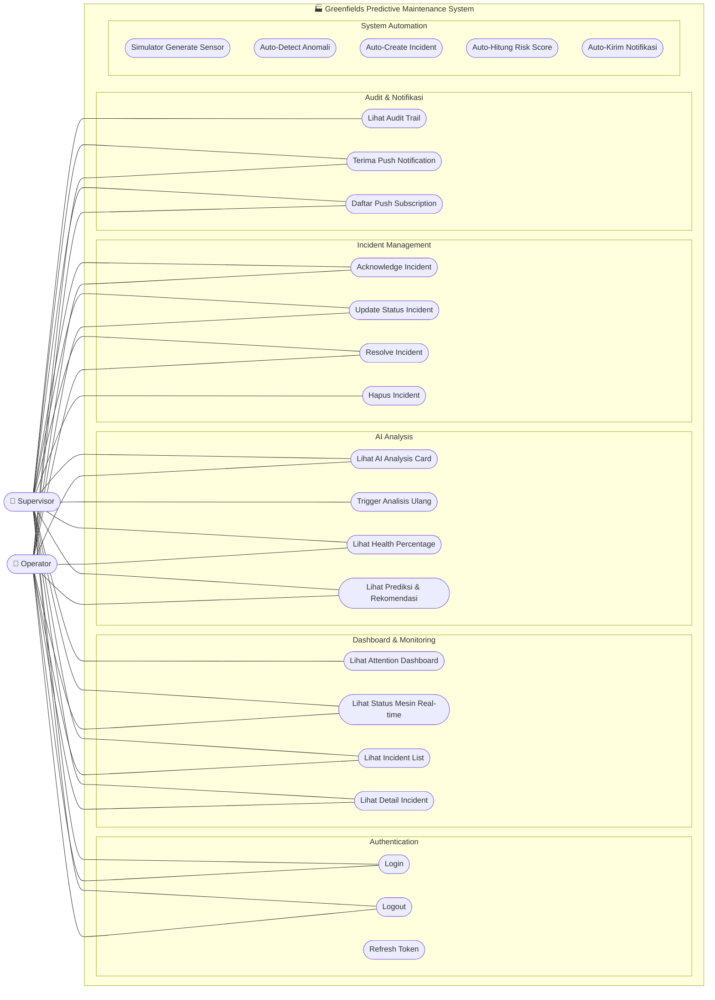
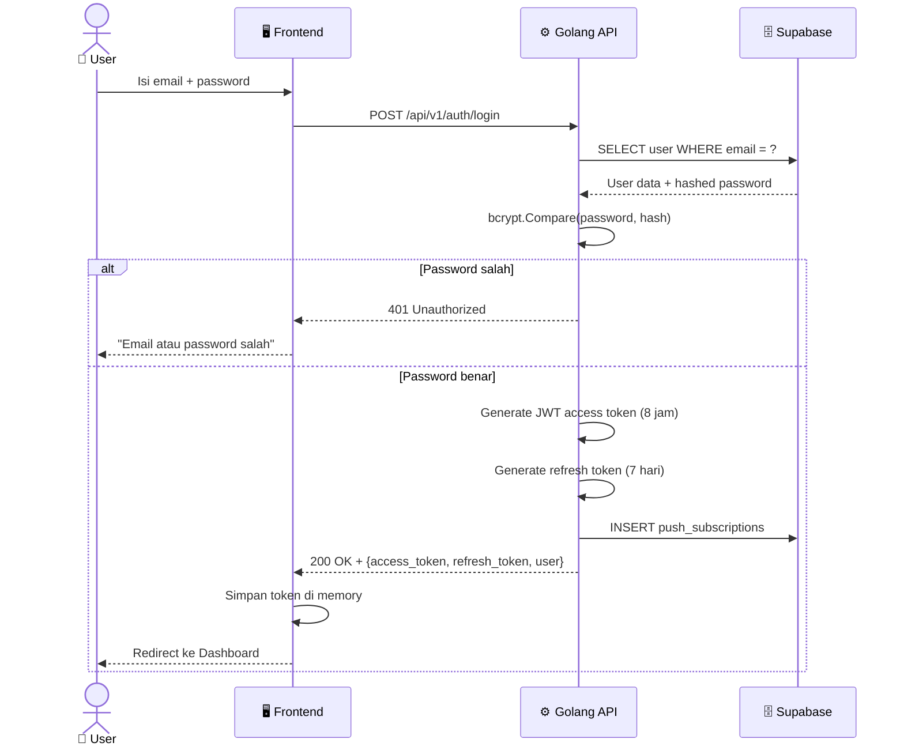
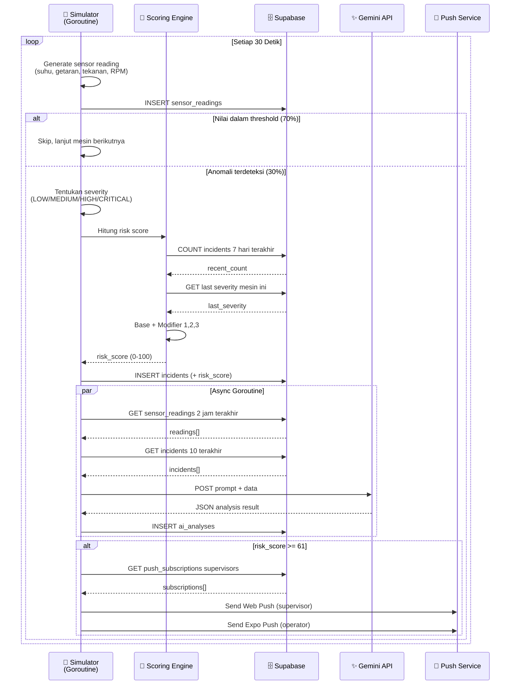
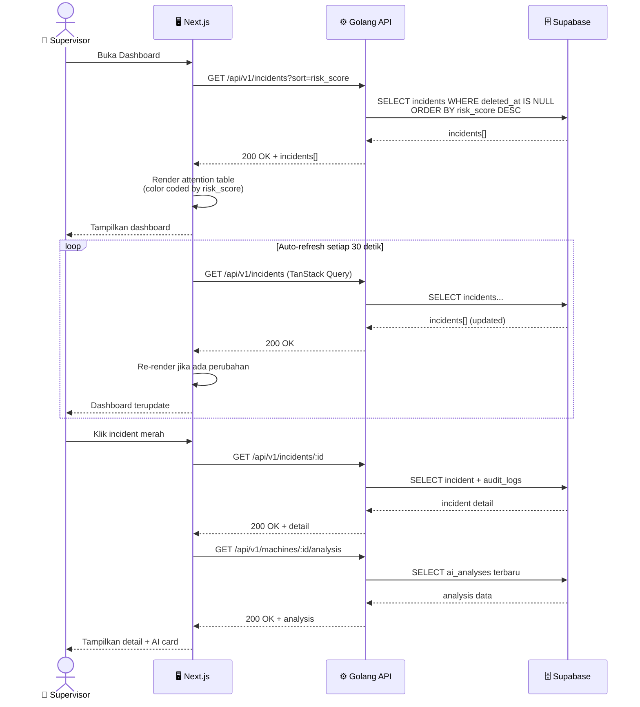
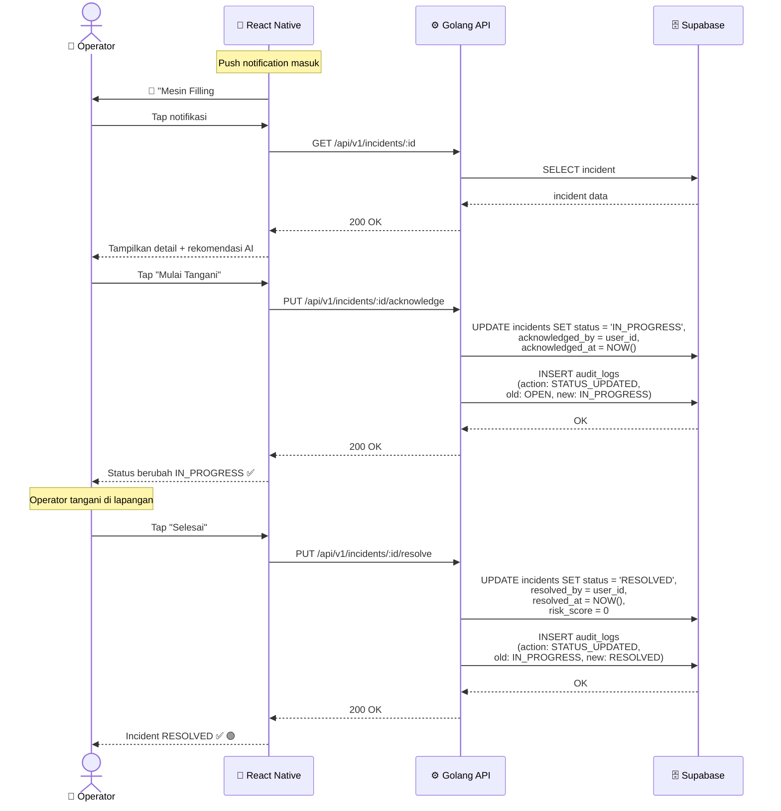
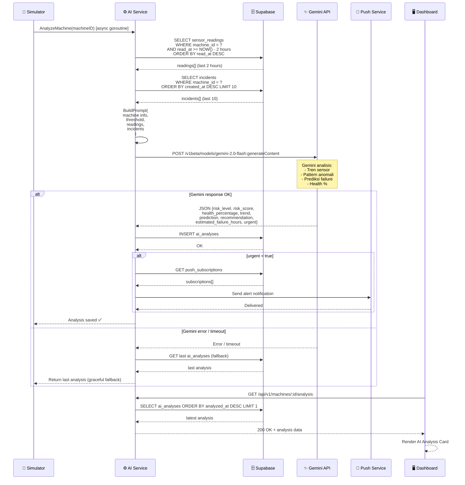
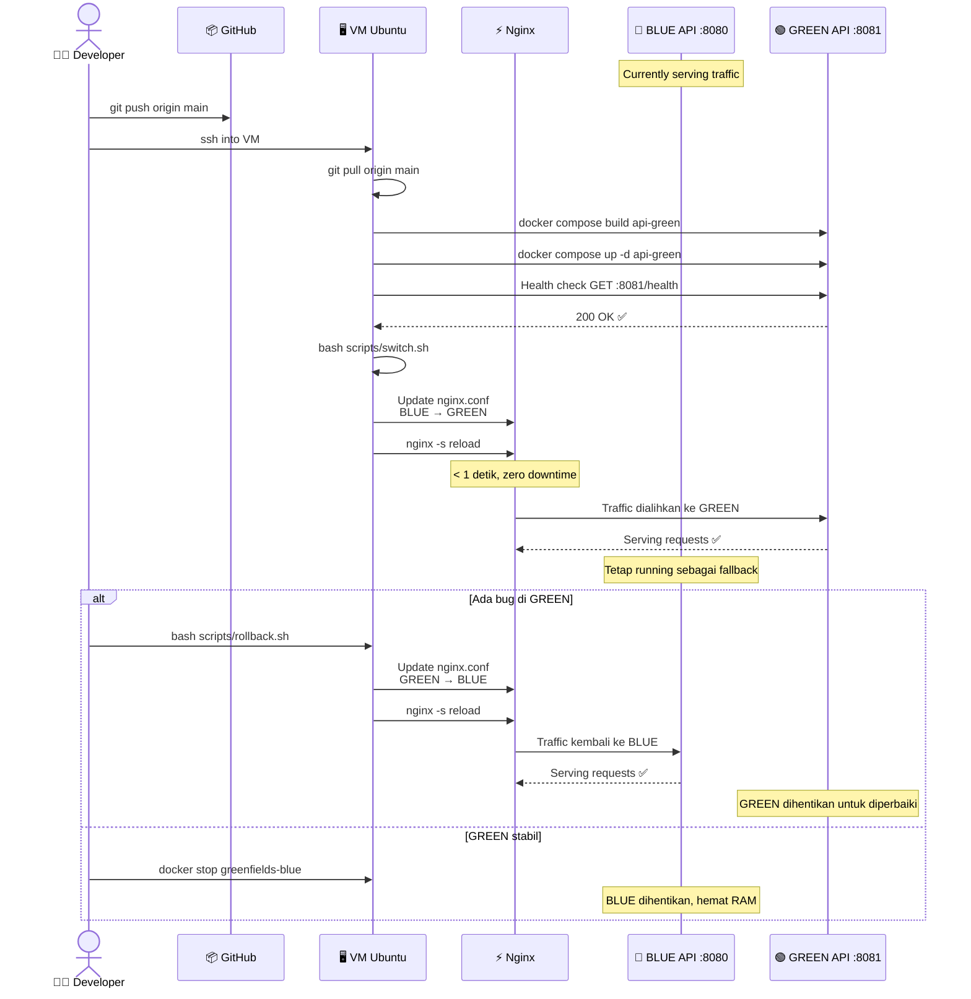

# 📐 UML Diagrams — Greenfields Predictive Maintenance

---

## 1. Use Case Diagram

> **Untuk Figma:** Gambarkan dua aktor (Supervisor & Operator) di kiri/kanan, use case sebagai oval di tengah, sistem sebagai kotak besar membungkus semua use case.

### Tabel Use Case

| ID | Use Case | Supervisor | Operator | Keterangan |
|---|---|---|---|---|
| UC1 | Login | ✅ | ✅ | Email + password |
| UC2 | Logout | ✅ | ✅ | Invalidate token |
| UC3 | Refresh Token | ✅ | ✅ | Otomatis oleh sistem |
| UC4 | Lihat Attention Dashboard | ✅ | ❌ | Full dashboard web only |
| UC5 | Lihat Status Mesin Real-time | ✅ | ✅ | Web + Mobile |
| UC6 | Lihat Incident List | ✅ | ✅ | Sorted by risk score |
| UC7 | Lihat Detail Incident | ✅ | ✅ | Web + Mobile |
| UC8 | Lihat AI Analysis Card | ✅ | ✅ | Health %, trend, prediksi |
| UC9 | Trigger Analisis Ulang | ✅ | ❌ | Supervisor only |
| UC10 | Lihat Health Percentage | ✅ | ✅ | Dari hasil Gemini |
| UC11 | Lihat Prediksi & Rekomendasi | ✅ | ✅ | Bahasa Indonesia |
| UC12 | Acknowledge Incident | ✅ | ✅ | OPEN → IN_PROGRESS |
| UC13 | Update Status Incident | ✅ | ✅ | Semua status |
| UC14 | Resolve Incident | ✅ | ✅ | IN_PROGRESS → RESOLVED |
| UC15 | Hapus Incident | ✅ | ❌ | Soft delete, supervisor only |
| UC16 | Lihat Audit Trail | ✅ | ❌ | Supervisor only |
| UC17 | Terima Push Notification | ✅ | ✅ | PWA (web) + Expo (mobile) |
| UC18 | Daftar Push Subscription | ✅ | ✅ | Saat pertama login |
| UC19-23 | System Automation | 🤖 | 🤖 | Dijalankan otomatis sistem |

---

## 2. Sequence Diagram — Login & Auth

> **Untuk Figma:** Gambarkan sebagai sequence diagram vertikal. Aktor di kiri, sistem di tengah, database di kanan.

---

## 3. Sequence Diagram — Simulator & Auto Incident

> **Untuk Figma:** Tunjukkan Simulator sebagai entitas terpisah yang berjalan otomatis tanpa trigger dari user.

---

## 4. Sequence Diagram — Supervisor Lihat Dashboard

---

## 5. Sequence Diagram — Operator Resolve Incident

---

## 6. Sequence Diagram — AI Analysis (Gemini)

---

## 7. Sequence Diagram — Blue-Green Deployment

---

## Ringkasan Diagram

| No | Diagram | Tipe | Fungsi |
|---|---|---|---|
| 1 | System Architecture | Flowchart | Gambaran besar semua komponen |
| 2 | ERD Database | Entity Relationship | Struktur & relasi tabel |
| 3 | Simulator Flow | Flowchart | Cara kerja auto-detection anomali |
| 4 | Risk Scoring Engine | Flowchart | Formula kalkulasi risk score |
| 5 | AI Analysis Flow | Flowchart | Alur integrasi Gemini API |
| 6 | Deployment Blue-Green | Flowchart | Zero-downtime deployment |
| 7 | User Flow | Flowchart | Alur Supervisor & Operator |
| 8 | **Use Case Diagram** | **UML** | Hak akses per role |
| 9 | **Sequence — Login** | **UML** | Alur autentikasi |
| 10 | **Sequence — Simulator** | **UML** | Alur auto-incident creation |
| 11 | **Sequence — Dashboard** | **UML** | Alur supervisor monitoring |
| 12 | **Sequence — Resolve** | **UML** | Alur operator tangani incident |
| 13 | **Sequence — AI Analysis** | **UML** | Alur integrasi Gemini + fallback |
| 14 | **Sequence — Blue-Green** | **UML** | Alur zero-downtime deployment |